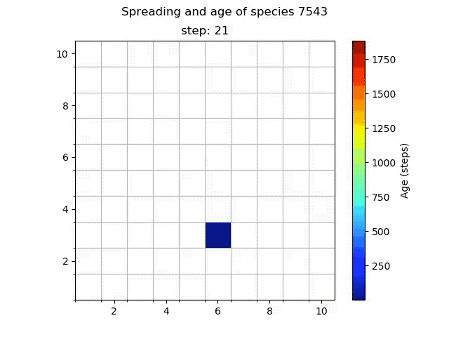
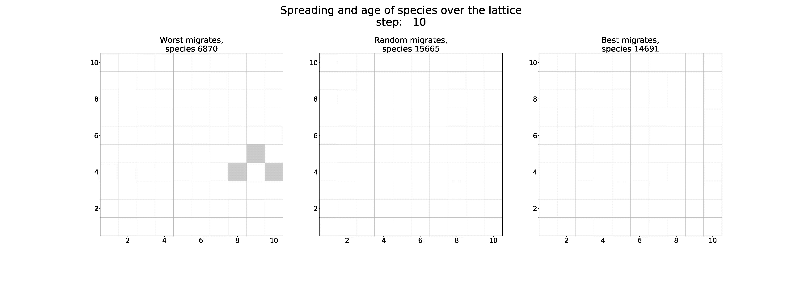
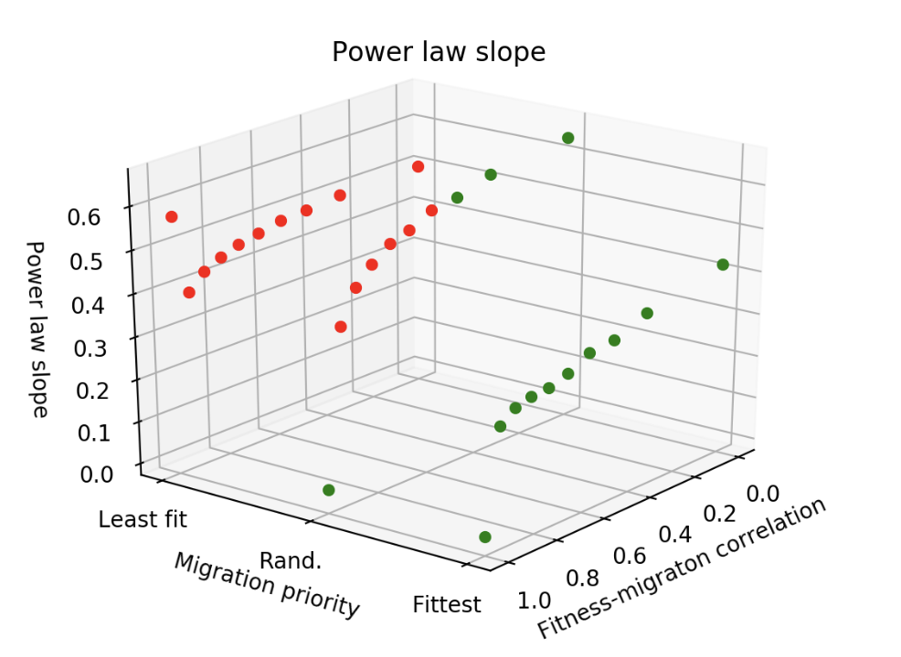
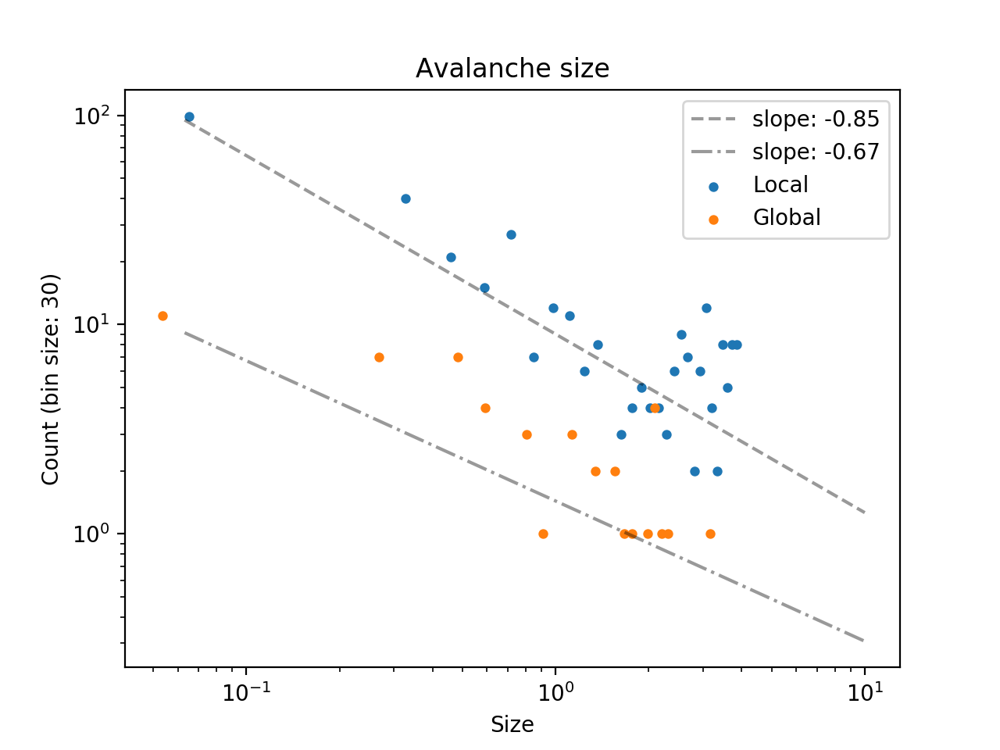
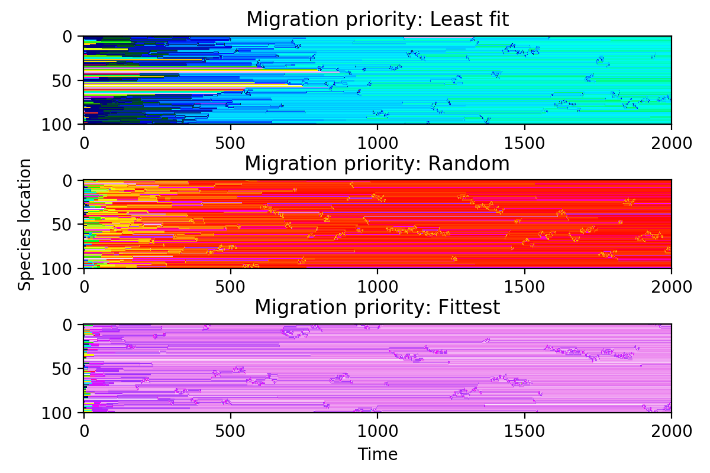
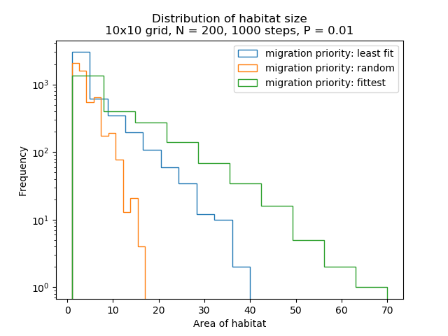

# Spatial extention of Bak-Sneppen model

By: Ruud Sperna Weiland, Mark Voschezang, Wouter Meering. Freek van den Honert, Thomas Start

## Original model

The Bak-Sneppen model is based on co-evolution. It consists of network of species. Every species has a fitness value and at each iteration the species with the lowest fitness is selected to go extinct. Its direct neighbours (connected nodes in the network) will go extinct as well. The extinct species are replaced by new species that have new (random) fitness values.

Wiki: [Bak-Sneppen](https://en.wikipedia.org/wiki/Bak%E2%80%93Sneppen_model)

## Spatial extension

We have extended the model to allow for spatial interactions. This is achieved by creating a spatial lattice that contains a distinct Bak-Sneppen model on each lattice point. During each extinction update in the local Bak-Sneppen models a Bernoulli trial (coin toss) is held to determine whether the new species is completely new (i.e. *mutation*), or originates from a neighbouring lattice point (i.e. *migration*). Thus, species can move over the lattice.

Several parameters are introduced to control this behaviour:

- `P: float in [0,1]`
The probability of *mutation*. The probability of *migration* is thus (1-P).
Lower values allow species to spread out more.

- `fitness-migration correlation: float in [0,1]`
This controls the speed at which the relative (local) fitness of species can change during migration. 

- `migration prioriy: least fit | random | fittest`

This video shows the effect of this parameter on the spreading of species over the lattice.

---

# Codebase

The [jupyter](https://jupyter.org/) notebook `Experiments.ipynb` contains a number of experiments and can be viewed [online](https://github.com/voschezang/Spatial-Bak-Sneppen/blob/master/Experiments.ipynb).

The major classes are `Lattice` and `BS` which represent the lattice and Bak-Sneppen models, respectively. They are located in the directory `src`. 

The directory `results` contains some images and videos, which are displayed below.

---

# Fitness distribution

# Species-area curve

This model exhibit patterns similar to the [species-area curve](https://en.wikipedia.org/wiki/Species%E2%80%93area_relationship), with comparable power law slopes as observed in nature.

## Effect of parameters on power law slope

The effect of the parameters `fitness-migration correlation` and `migration priority` on the power law slope of the species-area curve.

---

# Avalanches

The model features both local and global avalanches. 

These can grow system wide (i.e. O(1) perturbations can have O(N) effects)

## Fit of power law on avalache size

## 2D image of avalanches

---

## Habitat size

